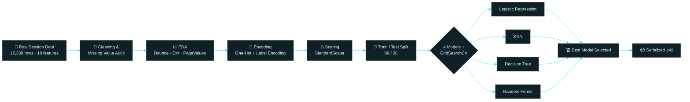

<div align="center">


<br/>

[](https://python.org)
[](https://scikit-learn.org)
[](https://pandas.pydata.org)
[](https://jupyter.org)
[](#-license)

<br/>


</div>

<br/>

## 🧠 Overview

**Shoppers Intention AI** analyzes real e‑commerce session behavior — page views, bounce rates, exit rates, session duration, and browsing patterns — to predict whether a visitor will **complete a purchase** before they ever click "checkout."

Built on the UCI **Online Shoppers Purchasing Intention Dataset** (12,330 real sessions, 18 features), this project benchmarks four classification algorithms end‑to‑end: from raw clickstream data → EDA → feature engineering → hyperparameter tuning → model comparison, giving e‑commerce teams a data‑driven early‑warning signal for conversion.

> Think of it as a **behavioral radar** for online stores — instead of waiting for revenue at checkout, it senses buying intent from *how* a customer moves through the site.

<br/>

## 📊 Live Model Comparison

<div align="center">

</div>

<div align="center">

| Rank | Model | Test Accuracy | Tuning Method | Verdict |
|:---:|:---|:---:|:---:|:---|
| 🥇 | **Random Forest** | **89.25%** | Baseline (GridSearchCV explored) | ✅ Best overall — robust to noise & non‑linearity |
| 🥈 | **Decision Tree** | 88.69% | GridSearchCV (`entropy`, depth=5) | Strong, highly interpretable |
| 🥉 | **Logistic Regression** | 87.27% | GridSearchCV (`C=1`, `l2`) | Solid linear baseline |
| 4️⃣ | **K‑Nearest Neighbors** | 86.58% | GridSearchCV (`k=9`, `distance`, `euclidean`) | Best CV score 87.78%, weaker on holdout |

</div>

<br/>

## 🎯 The Problem

Only **~15.5%** of shopping sessions in the raw data end in a purchase (1,908 of 12,330) — a heavily imbalanced, real‑world problem. The model has to learn subtle behavioral cues rather than relying on class frequency, which is exactly what makes this a genuinely useful benchmark rather than a toy dataset.

<div align="center">



</div>

<br/>

## 🧬 Feature Signals That Matter Most

<div align="center">

| Feature Group | What It Captures | Why It Predicts Intent |
|---|---|---|
| `BounceRates` / `ExitRates` | How quickly a visitor leaves | High rates → low intent to buy |
| `PageValues` | Google Analytics page value score | Strongest single purchase predictor |
| `ProductRelated` / `_Duration` | Time & depth spent on product pages | Engagement = intent signal |
| `Month`, `SpecialDay`, `Weekend` | Seasonality & proximity to holidays | Captures campaign‑driven spikes |
| `VisitorType` | New vs. Returning visitor | Returning visitors convert differently |
| `OperatingSystems`, `Browser`, `Region`, `TrafficType` | Technical & acquisition context | Channel‑level conversion differences |

</div>

<br/>

## 🛠️ Tech Stack

<div align="center">


<br/><br/>

`pandas` · `numpy` · `seaborn` · `matplotlib` · `plotly` · `scikit-learn` · `joblib`

</div>

<br/>

## ⚙️ Pipeline Breakdown

<details>
<summary><b>1️⃣ Exploratory Data Analysis</b> — click to expand</summary>
<br/>

- Full shape, dtype, null and duplicate audit (`12,330 × 18`, zero missing values)
- Distribution plots for `Revenue`, `VisitorType`, `Month`
- Bounce/Exit/PageValues boxplots split by purchase outcome
- Full correlation heatmap across numeric features

</details>

<details>
<summary><b>2️⃣ Feature Engineering</b> — click to expand</summary>
<br/>

- One‑hot encoding for categorical columns (`Month`, `VisitorType`, etc.)
- Label encoding pass for remaining categorical fields
- Boolean → integer conversion for `Weekend` and `Revenue`
- `StandardScaler` applied for distance‑based models (KNN, Logistic Regression)

</details>

<details>
<summary><b>3️⃣ Model Training & Tuning</b> — click to expand</summary>
<br/>

- **Logistic Regression** — `GridSearchCV` over `C` and `penalty`
- **K‑Nearest Neighbors** — tuned `n_neighbors`, `weights`, `distance metric`
- **Decision Tree** — tuned `criterion`, `max_depth`, `min_samples_split/leaf`
- **Random Forest** — ensemble baseline, explored via `GridSearchCV`
- 5‑fold cross‑validation (`cv=5`, `scoring='accuracy'`) throughout

</details>

<details>
<summary><b>4️⃣ Evaluation & Comparison</b> — click to expand</summary>
<br/>

- Accuracy scored on a held‑out 20% test split for every model
- Results consolidated into a single ranked comparison table
- Random Forest selected as the top performer

</details>

<br/>

## 🚀 Getting Started

```bash
# Clone the repository
git clone https://github.com/Omrawat11/shoppers-intention-model.git
cd shoppers-intention-model

# Create a virtual environment
python -m venv venv
source venv/bin/activate   # Windows: venv\Scripts\activate

# Install dependencies
pip install pandas numpy scikit-learn seaborn matplotlib plotly joblib jupyter

# Launch the notebook
jupyter notebook Shoppers_intention_model.ipynb
```

### Loading the trained model

```python
import joblib

model = joblib.load("Shoppers_intention_model.pkl")
prediction = model.predict(X_new)
```

> ⚠️ **Heads‑up:** the notebook's final export cell currently saves the **model class reference** rather than the **fitted `best_rf` estimator**, so the shipped `.pkl` isn't loadable as-is. Swap the last line to `joblib.dump(best_rf, "Shoppers_intention_model.pkl")` and re-run to ship a working, trained model file.

<br/>

## 📁 Project Structure

```
shoppers-intention-model/
├── 📓 Shoppers_intention_model.ipynb   # Full EDA → training → evaluation pipeline
├── 📦 Shoppers_intention_model.pkl     # Serialized model
├── 📄 online_shoppers_intention.csv    # UCI dataset (12,330 sessions)
└── 📝 README.md
```

<br/>

## 🗺️ Roadmap

- [ ] Fix serialization to export the fitted `best_rf` estimator
- [ ] Add SHAP-based explainability for feature‑level predictions
- [ ] Wrap the model in a Streamlit / FastAPI inference app
- [ ] Address class imbalance with SMOTE and compare F1/AUC
- [ ] Deploy as a real‑time API for live session scoring

<br/>

## 🙌 Acknowledgements

Built on the **Online Shoppers Purchasing Intention Dataset** (UCI Machine Learning Repository), a widely used benchmark for e‑commerce behavioral analytics.

<br/>

## 📜 License

Released under the **MIT License** — free to use, modify, and build on.

<br/>

<div align="center">

### 💬 Let's Connect

[](https://github.com/Omrawat11)
[](https://linkedin.com)


</div>
